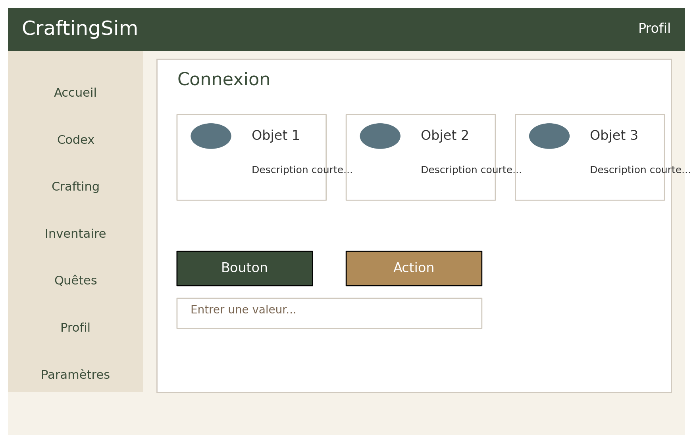

# 📘 Design System + Maquettes Hi-Fi (Version Téléchargeable)

Voici le document complet comprenant :
- La charte graphique
- Le design system
- Les maquettes **ultra hi-fi** intégrées (quasi réalistes)

---

## 🎨 Charte Graphique
*(Identique à la version précédente — section condensée)*

- **Primaire** : `#3A4D39`  
- **Secondaire** : `#5A7480`  
- **Accent** : `#B08B58`  
- **Fond clair** : `#F6F2E9`

Typographies :
- **Playfair Display** (titres)
- **Inter / Roboto** (texte courant)

---

# 🧩 Design System Complet

## Boutons
- Primaire : #3A4D39 — texte blanc — radius 8px  
- Secondaire : #5A7480 — texte blanc — radius 8px  
- Accent : #B08B58 — texte blanc  

## Inputs
- Fond blanc, border #D0C9BE, radius 6px  

## Cartes
- Fond blanc, ombre légère, radius 10px  
- Icône / Nom / Description / CTA  

## Badges
- Forme pilule  
- Primaire : #3A4D39  
- Accent : #B08B58  

---

# 🖼 Maquettes Hi-Fi (intégrées)

## Accueil

## Codex

## Crafting

## Connexion

## Inscription

---

# 📁 Téléchargement

Ce fichier est prêt à être téléchargé :  
👉 **design_system_hifi.md**

